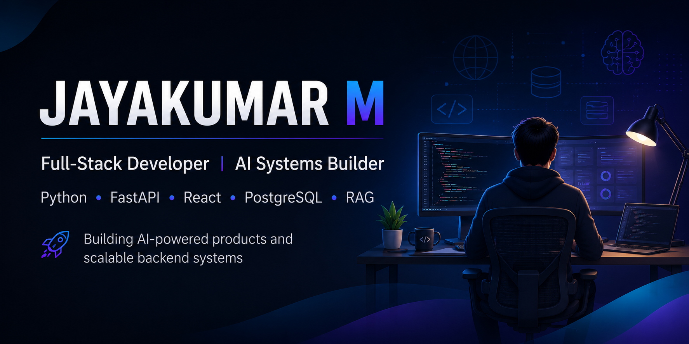

  

## Hi there, I'm Jayakumar M

Full-Stack Developer building AI-powered applications and scalable backend systems  

Interested in FastAPI, React, RAG, System Design, and real-world software products

- Currently building AI-powered applications and full-stack products
- Exploring Retrieval-Augmented Generation (RAG), email security, and scalable backend systems
- Building **InboxIQ AI**, an AI Email Security & Phishing Detection Platform
- Experienced with Python, FastAPI, React, Supabase, SQL, and REST APIs
- Focused on Backend Engineering, AI Systems, and Full-Stack Development
- Passionate about building practical products that solve real-world problems

### Connect with me

---

### Tech Stack

  
  
  
  
  
  
  
  
  
  
  
  

---

### Featured Projects

- **InboxIQ AI** — AI Email Security & Phishing Detection Platform that analyzes Gmail messages to detect phishing attempts, suspicious links, spoofing indicators, and email threats with risk scoring and AI-powered explanations.

### Tools

  
  
  
  
  

